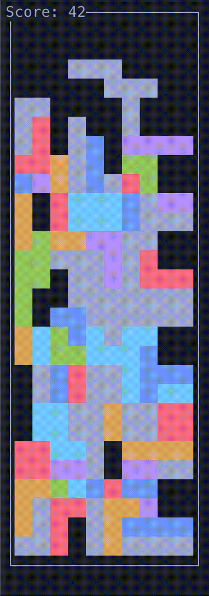
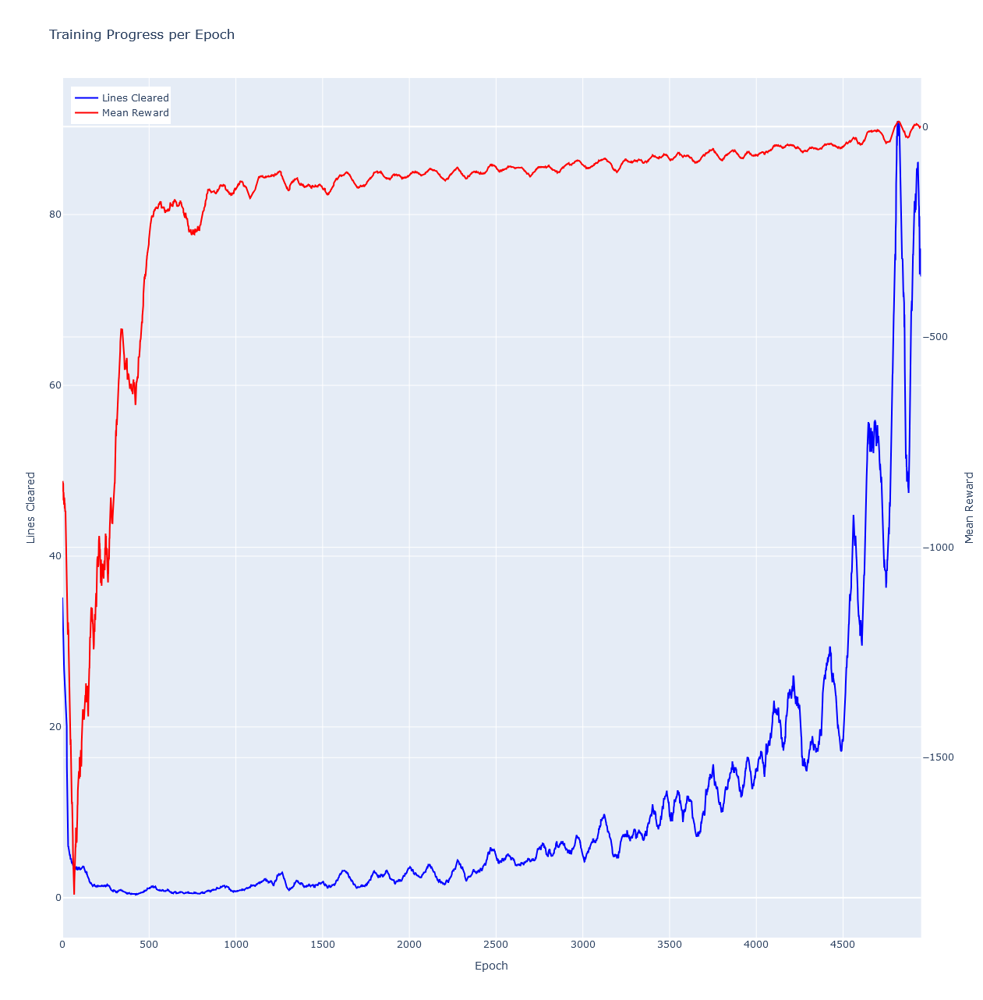

# AI learns cetris - Reinforement Machine Learning
tail -f ../logs/py_log_2025-02-17.txt


## TODOs

- [x] modify memory to include best rewards as bias. 

- [ ] record perfect matches, save to pickle and maybe pretrain on this for several episodes
- [ ] epochs in imitation training, also normal training
- [ ]  imitation training: partial random, partial completely expert
- [ ] unify batch training methods
- [ ] fix game-over funciton

- [x] priority based memory to favour recent experience
- [x] reduce size of C  logs
- [ ] initialize weights from uniform
- [x] include piece type in current state for cnn. i guess it doesnt know it right now
- [ ] normalize loss on batchsize
- [ ] logger queue for mp.Process
- [x] script to fetch logs from docker containers
- [x] deactivate oinly single thread in torch in qagent
- [ ] improve state function for tetris board - encode state to matrix with current position and all the blocks in the field. 
- [ ] in c: see next tetris piece
- [x] use seeds to fix the run: especially for debugging in the begining to know if it even works


- [x] is action space correct? research and write comprehensive documentation
    - [ ] still write documentation
- [x] test with easy tetroids
- [x] fix lines cleared!
- [ ] save outcomes to file where reward is bigger than 0
- [x] add some visualizations
- [x] batch processing only after n steps
- [x] tetrisexpert implementation


- [ ] documentation for piece_types:int  -> what is what?
- [x] add current_piece_count to state so that i can separate reward function from other code. 
- [x] maybe dockerize application so i can run several runs in parallel

- [ ] problem with placeholder action: state s1 received -> get action a1; s2 is direct result (has already new piece inserted!); s3 (=s2 + 1 tick) -> a2, s4, ...
    - remove the extra tick, has to be modified on c++ side. 


- [x] in tetris expert: if several actions ahave same reward, always first one is chosen -> make random to remove this bias
- [x] lines cleared from pipe is only 1 digit - what happens at more?


# run with docker
With docker it is possible to run several different configs for training. Each one uses just one core. 
different containers are available in `docker-compose.yaml`. 
To run one container, simply type: 

```bash
# run all experiments
docker-compose up

# run specific experiments
docker-compose up --build experiment_1
docker-compose up --build experiment_2

```

## Working version for four pieces reloaded
Switch to commit "856b9a834909d643897f0f2e2610bc221b455fea" and train the model from scratch. after about 15k episodes the model averaged to 7 lines cleared. Then I saved the model and tuned it with a smaller learning rate and a smaller replay memory. This helped to achieve ... pieces. 

This is a video showcasing the training process: 



## Working version for four pieces. 
Switch to commit "insert here". 

The model reached a plateau at about 8k episodes with avg 20 lines cleared. 
Uses the following hyperparams: 
```python
Training:
---------
EPSILON....................... 1.0
EPSILON_DECAY................. 0.996
DISCOUNT...................... 0.85
LEARNING_RATE................. 0.002
BATCH_SIZE.................... 64
COUNTER....................... 2000
EPOCHS........................ 2
NUM_BATCHES................... 70
MIN_EPSILON................... 0.01
EPSILON_COUNTER_EPOCH......... 50

Model:
------
BOARD_HEIGHT.................. 28
BOARD_WIDTH................... 10
FC_HIDDEN_UNIT_SIZE........... 150
NUMBER_OF_PIECES.............. 4

Environment:
------------
BASE_DIR...................... /app
SRC_DIR....................... /app/src
LOG_DIR....................... /app/logs
RES_DIR....................... /app/res
TETRIS_COMMAND................ /app/src/cpp/tetris

Communication:
--------------
FIFO_STATES................... fifo_states
FIFO_CONTROLS................. fifo_controls
COMMUNICATION_TIME_OUT........ 45.0
SLEEPTIME..................... 1e-06
INTER_ROUND_SLEEP_TIME........ 0.2

Experiment:
-----------
LOGGING....................... False
LOAD_MODEL.................... True
ITERATIONS.................... 100000
PLOT_COUNTER.................. 50
MOVING_AVG_WINDOW_SIZE........ 50
COUNTER_TETRIS_EXPERT......... 2

Other Variables:
--------------
ACTIONS....................... [-20, -19, -18, -17, -16, -15, -14, -13, -12, -11, -10, -9, -8, -7, -6, -5, -4, -3, -2, -1, 0, 1, 2, 3, 4, 5, 6, 7, 8, 9, 10, 11, 12, 13, 14, 15, 16, 17, 18, 19, 20, 21, 22, 23]
IMITATION_COLLECTOR........... False
IMITATION_LEARNING_BATCH_SIZE. 64
IMITATION_LEARNING_EPOCHS..... 15
IMITATION_LEARNING_LR......... 0.002
IMITATIO_LEARNING_BATCHES..... 130
MEMORY_EXPERT_MAXLEN.......... 60000
MEMORY_MAXLEN................. 150000
MEMORY_PATH................... ../res/precollected-memory/memory.pkl
MODEL_NAME.................... ../models/model
ONLY_TRAINING................. False

POSSIBLE_NUMBER_STEPS......... 4
SIMPLE_CNN.................... True
USE_LR_SCHEDULER.............. True
USE_RECENCY_BIAS.............. False
USE_REWARD_BIAS............... True
np............................ <module 'numpy' from '/usr/local/lib/python3.11/site-packages/numpy/__init__.py'>
os............................ <module 'os' (frozen)>
warnings...................... <module 'warnings' from '/usr/local/lib/python3.11/warnings.py'>
08:10:24- fd_states: 8 fd_controls: 7
``` 


## Working version for two pieces. 
Switch to commit `0ccc4eb0ee345ab8a20dfde3619505e0f51d0e36` and use `models/trained_two_pieces_new.pt`. In the commit `0ccc4eb` everything should work. Note that in order to run it on Docker, you also need to copy it in the `Dockerfile`!


The model improves drastically at about 4k-4.5k epochs. 
Uses the following hyperparams: 

```python
EPSILON....................... 1.0
EPSILON_DECAY................. 0.9955
DISCOUNT...................... 0.96
LEARNING_RATE................. 0.0008
BATCH_SIZE.................... 1024
COUNTER....................... 2000
EPOCHS........................ 2
NUM_BATCHES................... 40
MIN_EPSILON................... 0.045
EPSILON_COUNTER_EPOCH......... 50

Model:
------
BOARD_HEIGHT.................. 28
BOARD_WIDTH................... 10
FC_HIDDEN_UNIT_SIZE........... 128
NUMBER_OF_PIECES.............. 2

Environment:
------------
BASE_DIR...................... /app
SRC_DIR....................... /app/src
LOG_DIR....................... /app/logs
RES_DIR....................... /app/res
TETRIS_COMMAND................ /app/src/cpp/tetris

Communication:
--------------
FIFO_STATES................... fifo_states
FIFO_CONTROLS................. fifo_controls
COMMUNICATION_TIME_OUT........ 45.0
SLEEPTIME..................... 1e-06
INTER_ROUND_SLEEP_TIME........ 0.2

Experiment:
-----------
LOGGING....................... False
LOAD_MODEL.................... False
ITERATIONS.................... 100000
PLOT_COUNTER.................. 50
MOVING_AVG_WINDOW_SIZE........ 50
COUNTER_TETRIS_EXPERT......... 1            # works also with 2 or 3

```



## Experiments 

## 12.02
- exp 2: new expert period test

## 11.02
- exp 1: imitation learning with pretrained model from yesterday
- exp 2: further training of yesterdays model, with lower gamma=0.85
- exp 4: further training of yesterdays model with gamma=0.95
- exp 6: also further training, lower mem, gameover penalty revisited, num batches 35, no bias

### 10.02
- exp 1,7 - new architecture, batches= 70, no bias
- exp 2   - 150 num batches, more imitation learning
- exp 3   - same as above, no imitation learning
- exp 4   - old arch, 300 batches 
- exp 5   - new arch, 40k mem, higher lr, gamma only 0.85!


### 08.02
- exp4: simple reward, no imitation learning
- exp5: simple reward + imitation learning, epsilon = 1.0

 
### 07.02
experimenting with four pieces + new imitation learning. 
Seems to be promising, going to do more experiments with pretraining. 

current running experiments: 
- exp1: complex reward
    ```python 
    IMITATION_LEARNING_LR         = 0.002       # learning rate only used in pretraining
    IMITATIO_LEARNING_BATCHES     = 130     # currently not used
    IMITATION_LEARNING_EPOCHS     = 25
    # memory objs
    # max length for the memory objects
    MEMORY_MAXLEN        = 40000
    MEMORY_EXPERT_MAXLEN = 20000
    # biases for sampling from memory   
    USE_REWARD_BIAS  = True     # favor best reward-samples in memory
    USE_RECENCY_BIAS = False    # favor recently collected samplses (partially unifromly)

    ```
- exp4: same as above, but with simple reward
- exp6: same as exp4, but epochs = 14
- currently epsilon is 0.02! no random exploration => test this next

all of them did not work 

- exp1: simple reward, reward bias, epochs=3
- exp2: same as e1, but no reward bias. 
- epx5: new reward with holes
- exp6: exp5 + piece embedd
- exp7